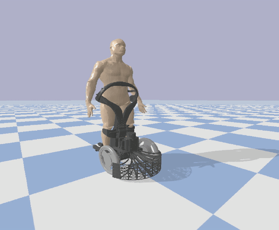
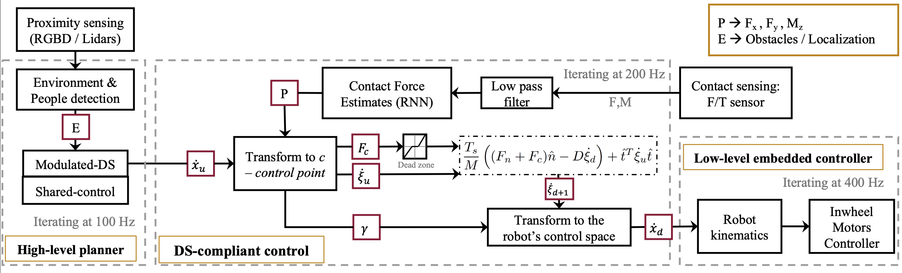
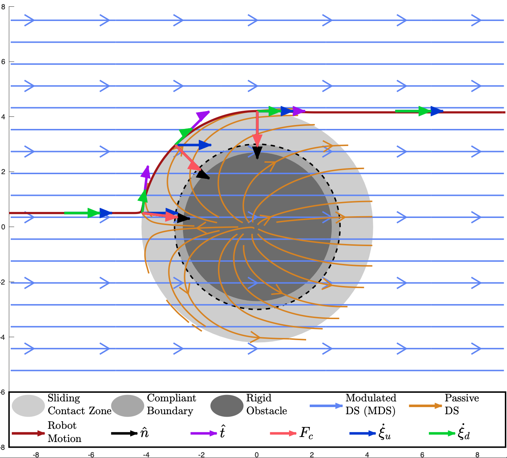
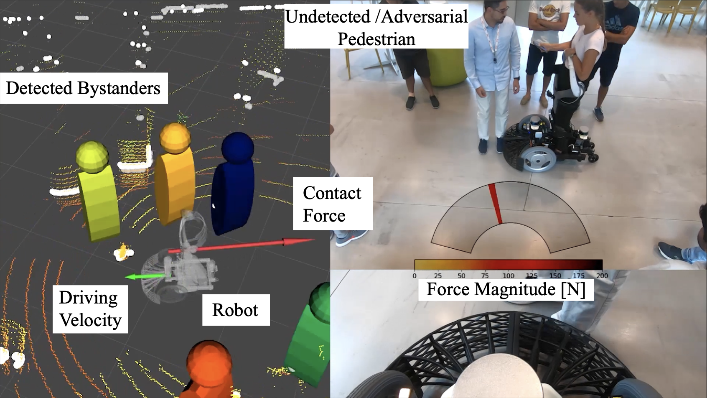
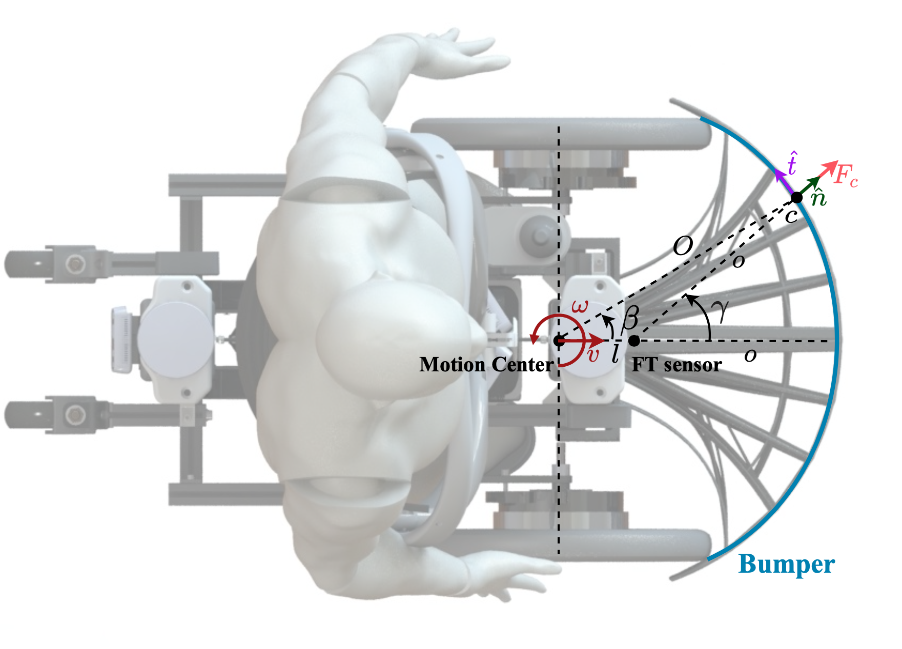
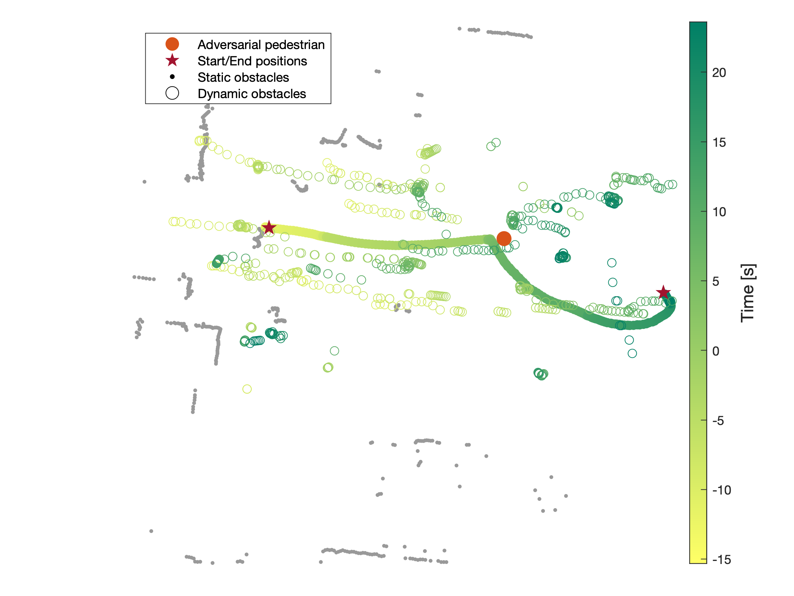
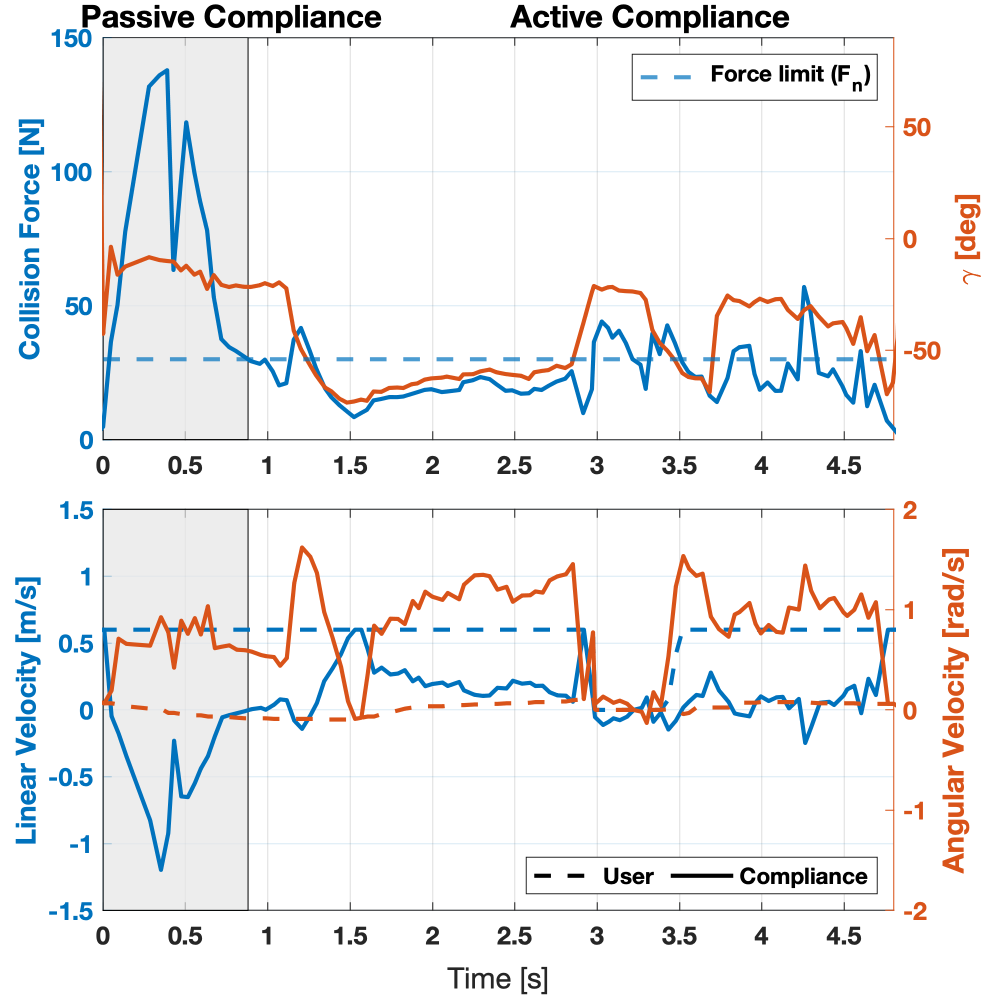
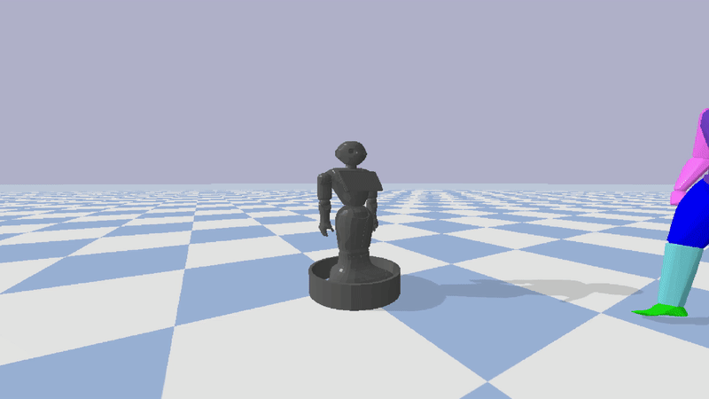

# Compliant DS for Mobile Robots (sliding-ds):

Repository with controller in Python and Matlab for Passsive Dynamical Systems control focused on mobile robots compliance repsonse to impact and Sliding response for advancing around pedestrians/obstacles. 

<p align="center">
  
  
</p>

Showing an integrated controller in 2D navigation with Dynamical Systems based [obstacle avoidance](https://github.com/epfl-lasa/dynamic_obstacle_avoidance_linear).
  
<p align="center">
  
</p>

**Cite as:**

[1] Paez-Granados D., Gupta V. and Billard, A. “Unfreezing Social Navigation: Dynamical Systems based Compliance for Contact Control in Robot Navigation”. IEEE International Conference on Robotics and Automation, ICRA-2022.
```
@inproceedings{Paez_ICRA22,
   author = {Diego Paez-Granados and Vaibhav Gupta and Aude Billard},
   city = {Philadelphia (PA), USA},
   issue = {1},
   journal = {IEEE International Conference on Robotics and Automation (ICRA)},
   keywords = {Complaint control,crowd navigation,obstacle avoidance},
   month = {5},
   pages = {1-7},
   publisher = {IEEE},
   title = {Unfreezing Social Navigation : Dynamical Systems based Compliance for Contact Control in Robot Navigation},
   volume = {1},
   url = {https://youtu.be/y7D-YeJ0mmg%0Ahttp://infoscience.epfl.ch/record/287442?&ln=en},
   year = {2022},
}

```

-------------
Requirements:
```
Scripts for 2D simulation require matlab2020+
Alternatively 3D simulation is available through pybullet.

Requirements for python execution: conda, jupyter notebook, python3.

Setup:
  git clone https://github.com/epfl-lasa/sliding-ds-control.git
  
  # To use pybullet submodule:
  git submodule update --init

```
-------------

## Repository Structure


### Data

data/ : Folder linking to experimental data of collision calibrations for the bumper and data of experimental setup.

### Scripts

scripts/matlab: Containts simulations for passive compliance assuming a constant spring for adversarial pedestrians --> Use the script [simulation](scripts/matlab_scripts/simulation.m) for running the code.
  
scripts/pybullet_simulator: submodule to a [pybullet_collision](https://github.com/epfl-lasa/human-robot-collider) simulator with a walking pedestrian that implements the sliding_DS in multiple robots.

### Visualization

images/ Includes some pictures of the method, simulation and experiments.


### Controller

src/ python [controller](src/compliance_controller) used in experiments with the robot Qolo and in the simulator. 

-------------

### Passive Compliance Method

<p align="center">
  
</p>

Here, a linear-DS was depicted with the robot represented as a holonomic point-mass (any point in this Cartesian space) and the pedestrian in contact as a convex shape. 
There are two zones of contact with the obstacle represented by: first, a physically impenetrable obstacle (dark grey), and second, a deformable region of the obstacle with a compliant boundary (dotted line) which allows controlling for safe contact force. 
Finally, we mark a sliding zone (lighter-grey) that represents the volume occupied by the robot during contact around the obstacle.

Execution with an adversarial obstacle not perceived by the underlying obstacle avoidance modulated DS: 
<p align="center">
  
</p>

-------------

# Experimental Setup and Evaluation:

<p align="center">
  
</p>

Using the robot Qolo [2] in shared control mode [4] and autonomous driving with modulated DS [5] we evaluated the sliding DS response with a frontal bumper:

<p align="center">
  
</p>

The results with an adversarial pedestrian shows a positive sliding response around the obstacle:

<p align="center">
  
  
</p>

-------------

# Applications with other Robots:

We show here two examples of application in other mobile robots through a pybullet simulator with walking pedestrians [P4] [check full repository here](https://github.com/epfl-lasa/human-robot-collider):

1. An omnidirectional (holonomic) robot:
<p align="center">
  
</p>
  
2. A non-holonomic robot - smart wheelchair:
<p align="center">
  
</p>

-------------
## Related packages:

[P1] Main ROS controller for Qolo-robot
https://github.com/DrDiegoPaez/qolo_ros

[P2] Obstacle avoidance for tight shape and non-holonomic constraints (used in shared control) [4]
https://github.com/epfl-lasa/rds

[P3] Obstacle avoidance based on dynamical systems [5]:
https://github.com/epfl-lasa/qolo_modulation
https://github.com/epfl-lasa/dynamic_obstacle_avoidance

[P4] Pybullet pedestrian collision simulator:
https://github.com/epfl-lasa/human-robot-collider

## References:

> [1] Paez-Granados D., Gupta V. and Billard, A. “Unfreezing Social Navigation: Dynamical Systems based Compliance for Contact Control in Robot Navigation”. 2022. (Under review)

#### Qolo Design:
> [2] Paez-Granados, D. F., Kadone, H., & Suzuki, K. (2018). Unpowered Lower-Body Exoskeleton with Torso Lifting Mechanism for Supporting Sit-to-Stand Transitions. IEEE International Conference on Intelligent Robots and Systems, 2755–2761. https://doi.org/10.1109/IROS.2018.8594199

#### Qolo Hands-free control:

> [3] Chen, Y., Paez-Granados, D., Kadone, H., & Suzuki, K. (2020). Control Interface for Hands-free Navigation of Standing Mobility Vehicles based on Upper-Body Natural Movements. IEEE/RSJ International Conference on Intelligent Robots and Systems (IROS-2020). https://doi.org/10.1109/IROS45743.2020.9340875

#### Qolo shared control:

> [4] Gonon, D. Paez-Granados, D., Billard, A. (2021). Reactive Controller for a Convex Non-holonomic Robot to Travel in Crowds. IEEE Robotics and Automation Letters (IEEE-RAL).

#### Obstacle avoidance through modulated-DS:

> [5] Huber, Lukas, Aude Billard, and Jean-Jacques E. Slotine. (2019) "Avoidance of Convex and Concave Obstacles with Convergence ensured through Contraction." IEEE Robotics and Automation Letters (IEEE-RAL).


**Contact**: 
[Dr. Diego Paez](https://diegofpaez.wordpress.com/)

**Acknowledgments**
This project was partially founded by:

> The EU Horizon 2020 Project CROWDBOT (Grant No. 779942): http://crowdbot.eu

> The Toyota Mobility Foundation (TMF) through the Grant: Mobility Unlimited Challenge 2019: https://mobilityunlimited.org
