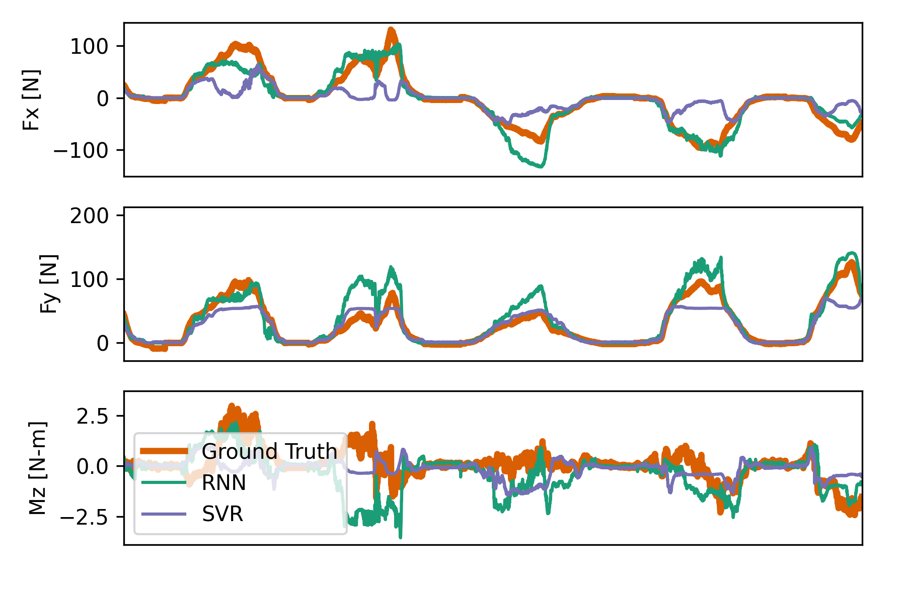

# Models for compliant bumper

Folder with training for RNN model of the compliant bumper and its comparison with the SVR model.

 
<tt>Fig: Comparison between RNN model and SVR model</tt>

-------------

## Jupyter Notebooks
- **search_RNN_hyperparam.ipynb** contains the training instructions for RNN model.
- **train_RNN.ipynb** contains the training instructions for RNN model.
- **comparison.ipynb** compares the RNN model with SVR model using the real-time python controller used for experiments.

-------------

## Running Instructions
All the notebooks can be run using Google Colaboratory. Set the `Hardware accelerator` to `GPU` in `Edit>Notebook settings`.

### Direct links to the Google Colaboratory
- **search_RNN_hyperparam.ipynb:** 
- **train_RNN.ipynb:** 
- **comparison.ipynb:** 

-------------

## Quick comparison

### Training Performance
> |             |SVR                |RNN                |
> |-------------|------------------:|------------------:|
> | $F_x$ [N]   | $-0.81 \pm 15.82$ | $-0.19 \pm  8.25$ |
> | $F_y$ [N]   | $21.68 \pm 42.53$ | $-0.95 \pm 13.08$ |
> | $M_z$ [N m] | $ 0.06 \pm 20.20$ | $-0.06 \pm  1.01$ |

### Testing Performance
> |             |SVR                |RNN                |
> |-------------|------------------:|------------------:|
> | $F_x$ [N]   | $-3.93 \pm 31.67$ | $-0.16 \pm  9.99$ |
> | $F_y$ [N]   | $36.55 \pm 46.55$ | $-4.36 \pm 14.99$ |
> | $M_z$ [N m] | $-1.09 \pm 16.10$ | $ 0.10 \pm  0.82$ |

### On-board Computation Time [ms]
> |             |SVR      |RNN      |
> |-------------|--------:|--------:|
> | Time [ms]   | $10.63$ | $0.383$ |
